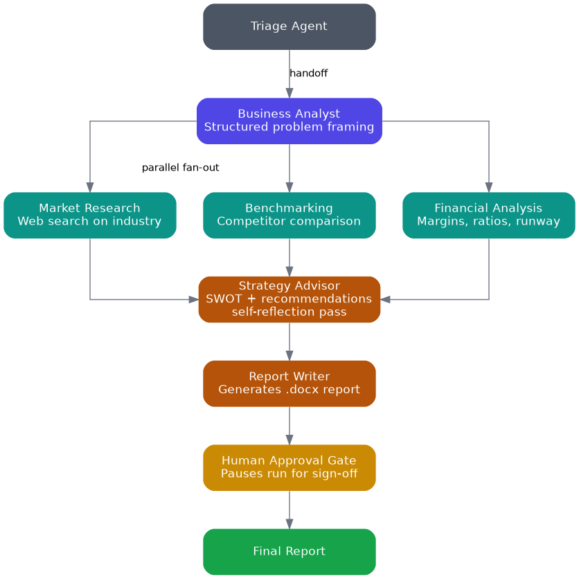

# 🧠 AI Management Consultant — Multi-Agent System

A multi-agent AI consulting system built on the **OpenAI Agents SDK** that takes a business
problem statement and runs it through a full engagement: problem framing → market research →
competitive benchmarking → financial analysis → strategy synthesis → a human-approved,
downloadable `.docx` consulting report.

Built as a capstone project for an Agentic AI course, on **zero-cost infrastructure** — no
paid API keys required.

---

## 1. Problem Analysis

**Business context.** Small and mid-sized businesses considering a major strategic move
(market expansion, new sales channel, pricing change) rarely have in-house access to the kind
of structured, multi-angle analysis a management consulting firm would provide — market sizing,
competitive benchmarking, financial feasibility, and a synthesized recommendation. That analysis
is expensive and slow to get from a human consultant.

**Stakeholders.** Small-business owners/founders (the client), and — since the report ends with
a human-approval gate rather than auto-publishing — a decision-maker who reviews the AI-generated
analysis before it's treated as final.

**Problem statement.** Build an AI system that can take a raw, informally-stated business problem
and produce a structured, evidence-backed consulting report: problem framing, market research,
competitive benchmarking, financial analysis, and prioritized strategic recommendations — with a
human sign-off step before the report is considered final.

**Objectives.**
- Automate the repeatable parts of an early-stage consulting engagement (research, benchmarking,
  ratio calculations, first-draft strategy) without removing human judgment from the final call.
- Produce a professional, shareable deliverable (`.docx`), not just a chat transcript.
- Do it on infrastructure a student/solo builder can actually afford — free-tier APIs only.

---

## 2. Multi-Agent Design

### Architecture



### Roles

| Agent | Role | Model / Provider |
|---|---|---|
| **Triage Agent** | Confirms scope, hands off to Business Analyst | Gemini |
| **Business Analyst** | Structured problem framing (industry, constraints, data gaps) | OpenRouter (free) |
| **Market Research Agent** | Live web search for market size, growth, trends | OpenRouter (free) |
| **Benchmarking Agent** | Identifies real named competitors, strengths/weaknesses | Groq (Llama 3.3 70B) |
| **Financial Analysis Agent** | Computes margins, current ratio, cash runway | Gemini |
| **Strategy Advisor** | Synthesizes everything into SWOT + prioritized recommendations, with a self-review pass | Gemini |
| **Report Writer** | Writes executive summary, generates `.docx`, requests human approval | Groq (Llama 3.1 8B) |

### Handoff flow
Triage → Business Analyst is a **typed SDK handoff** (not a manual function call) — it passes a
structured `HandoffInput` (a one-sentence reason) so the receiving agent has context on why the
engagement was routed to it.

### Tool integration overview
8 tools across the 7 agents: a mock knowledge-base/RAG search, live DuckDuckGo web search, a
competitor-archetype lookup, two financial calculators (ratios + runway), a findings logger that
writes to shared context, `.docx` report generation, and a human-approval gate.

---

## 3. Implementation

- ✅ **7 specialized agents** (exceeds the 5-agent minimum)
- ✅ **8 tools**: `knowledge_base_search`, `web_search`, `competitor_benchmark_lookup`,
  `financial_ratio_calculator`, `runway_calculator`, `log_finding`, `generate_docx_report`,
  `request_human_approval`
- ✅ **Agent handoffs** — typed handoff from Triage to Business Analyst
- ✅ **Memory/context management** — a shared `ConsultingContext` dataclass threads structured
  results between stages (see *Design Decision* below for why this replaced a shared
  conversation session)
- ✅ **Structured outputs** — Pydantic schemas (`BusinessProblemAnalysis`, `MarketResearch`,
  `BenchmarkReport`, `FinancialAnalysis`, `StrategyRecommendation`) define every stage's expected
  fields; tool arguments are fully typed
- ✅ **Human approval** — the engagement pauses before the report is finalized; a human must
  approve or reject

## 4. Advanced Features

- ✅ **Parallel agent execution** — Market Research, Benchmarking, and Financial Analysis run
  concurrently via `asyncio.gather`, each on a different API key/provider to avoid rate-limit
  collisions
- ✅ **Reflection / self-review** — the Strategy Advisor explicitly re-checks its own
  recommendations against the supplied data before finalizing (`self_review_notes`)
- ✅ **Error handling and logging** — every stage is wrapped with typed exception handling
  (`MaxTurnsExceeded`, `AgentsException`) and an audit trail (`findings_log`) records every
  agent's key findings across the run
- ⬜ RAG/long-term knowledge retrieval — a lightweight mock knowledge-base search is included;
  swapping in a real vector store is a natural next step
- ⬜ Session persistence — intentionally **not** used across the full pipeline (see below)

### Design decision: why there's no shared conversation session

An earlier version threaded one `SQLiteSession` through all 7 agent calls. That meant every
later stage silently replayed the *entire* prior conversation (every tool call and result) as
input tokens — by the final stage, that's a large, fast-growing prompt on every single call. This
was the actual cause of free-tier quota exhaustion, independent of how many API keys were used to
spread the load. The fix: each stage now receives an explicit, purpose-built prompt assembled
from the shared context object, so input size scales with that stage's own work, not the whole
engagement's history.

### Design decision: why some agents don't combine `tools` with `output_type`

Several free-tier providers (notably Groq) reject a single request that combines tool-calling
with a strict JSON-schema response format. Rather than forcing every provider into a shape only
OpenAI's own API fully supports, the tool-using agents end their turn with a clearly labeled
plain-text summary; the Pydantic schemas still define and document the expected shape of that
output for grading/tooling purposes.

---

## 5. Setup

Requires **4 free API keys** (no credit card needed for any of them):

| Env var | Get it at |
|---|---|
| `GEMINI_API_KEY` | https://aistudio.google.com/apikey |
| `GROQ_API_KEY_1` | https://console.groq.com/keys |
| `GROQ_API_KEY_2` | a second Groq key |
| `OPENROUTER_API_KEY` | https://openrouter.ai/keys |

```bash
pip install openai-agents python-docx pydantic python-dotenv ddgs nest_asyncio
```

Open `AI_Management_Consultant.ipynb` in Jupyter/Colab/VS Code and run all cells top to bottom.
Edit the arguments in the "Run it" cell to analyze your own business problem instead of the demo
(a fictional bakery expansion).

**Known limitation:** free-tier daily request caps (50–1,000 requests/day depending on provider)
mean repeated same-day runs can exhaust quota partway through a stage. A one-time $10 credit
top-up on OpenRouter raises its cap from 50 → 1,000 requests/day permanently, which comfortably
covers normal use.

---

## Example output

Given: *"We want to expand from 1 retail location to a regional wholesale + e-commerce model
within 18 months. Should we, and how?"* for a fictional artisan bakery — the system produces a
multi-section `.docx` report with real named competitors (sourced via live web search), computed
financial ratios, and a prioritized, rationale-backed recommendation list, e.g. *"Implement a
phased, capital-light expansion pilot"* before committing to a second production line.
